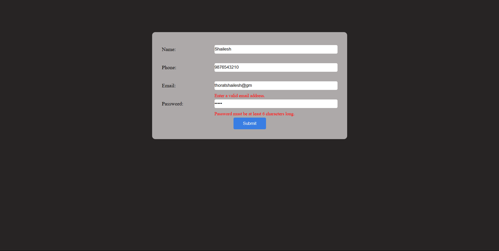

# 📝 Form Validation Project

## 🚀 Overview

A simple client-side form validation project using **HTML, CSS, and JavaScript**. This form ensures that users provide valid input before submission.

## 🛠 Features

- Validates **Name, Email, and Password** fields.
- Displays error messages **below the input fields**.
- Prevents form submission if fields are invalid.
- Uses **JavaScript event handling** for validation.

## 📌 Technologies Used

- **HTML** (Form structure)
- **CSS** (Styling & layout)
- **JavaScript** (Validation logic)

## 📂 Project Structure

```
📁 form-validation
|── 📁images
    |── 📄 form-validation.png
│── 📄 index.html      # Main HTML file
│── 📄 style.css       # Stylesheet
│── 📄 script.js       # JavaScript for validation
│── 📄 README.md       # Project documentation
```

## 🔧 How to Run

1. **Clone the repository**
   ```sh
   git clone https://github.com/yourusername/form-validation.git
   ```
2. **Navigate to the project folder**
   ```sh
   cd form-validation
   ```
3. **Open `index.html` in a browser**

## 📸 Screenshots



## 📝 License

This project is licensed under the MIT License - see the [LICENSE](LICENSE) file for details.

## 🤝 Contributing

Feel free to submit pull requests or open issues to improve this project.

### ⭐ Star the Repository

If you found this project helpful, please give it a ⭐ on GitHub!
